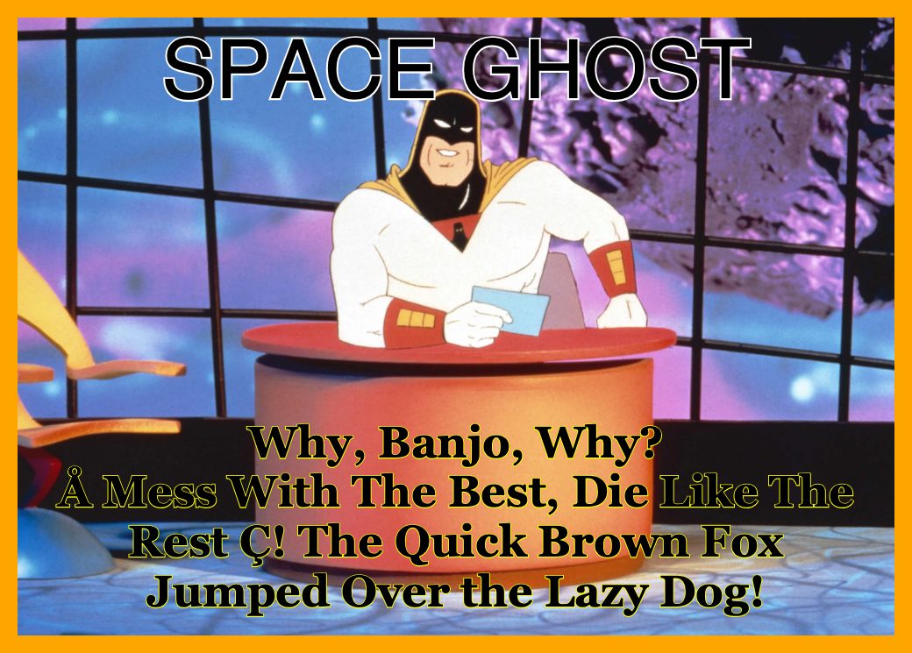

# Raydreams.Meme

For now, Raydreams.Meme is a simple x-platform .NET command line tool that will meme any image from a URL or local image file. Since there are several options you can set, you must use a JSON options file like the example below.

## To Do

+ Add default settings to settings file
+ Move some hard coded values to the settings file
+ Add footer option
+ Add Save to JPEG option

## Setup

Make sure you have the [latest .NET 10 SDK](https://dotnet.microsoft.com/en-us/download/dotnet/10.0) installed on your computer. Otherwise download the SDK Installer for your environment.

```sh
dotnet --version
```

Clone this repo locally, change to the folder and use

```sh
dotnet restore // restore all dependencies
dotnet build // build the entire solution
dotnet clean // to clean all builds
```

To run just use

```sh
dotnet run --project Raydreams.Meme -- -o "/Users/bob/Desktop/test/meme-test.json" -f "test"
```

To build just build a Release version of the Command Line exe

```sh
dotnet build Raydreams.Meme/Raydreams.Meme.csproj --configuration Release
```

You can copy the `bin/Release/net10.0` folder to wherever you like and even rename it or add the output option to specify a build location.

## Command Line Options

+ -p, --params \<filepath> Full path to the image options. See included JSON file example.
+ -o, --output \<file name> Just the name of the output file with **no extension** which will be in the same folder as the options
+ -s, --size \<int> Size of the longest dimension to resize the final image to not including border
+ -f, --format \<PNG|JPG> Defaults to .png but set to `jpg` to change to JPEG format
+ -d, --debug \<bool> Draw debugging rects



## Example Options File

```json
{
    "src": "https://raydreamsdevsa002.blob.core.windows.net/public/cGrQXATxQBb.jpg",
    "os": 40,
    "border": "orange",
    "pad": 40,
    "filter": "Identity",
    "crop": "Original",
    "title": "SPACE GHOST",
    "ts": 80,
    "tf":"Georgia Pro Semibold",
    "tc": "black",
    "tsc": "white",
    "tsw": 50,
    "body": "Why, Banjo, Why?",
    "bc": "white",
    "bs": 200,
    "bsw": 50,
    "bsc": "yellow",
    "bf":"Georgia",
    "valign": "bottom"
}
```

|PROPERTY|FIELD|TYPE|DESCRIPTION|DEFAULT|
|--------|-----|----|-----------|-------|
|image source|src|string|This is the absolute complete URL to a web iamge, local file path OR a web color name.|white|
|border color|border|Color String|The border color|red|
|border size|os|int [0,300]|Pixel thickness of the image border where 0 is no border.|0|
|padding|pad|int|Pixel size of the inside border padding.|20|
|title|title|string|The header title to appear at the top of the image.|
|title font family|tf|string (Font Family Name)|The name of the font family to use for the title font.|Arial|
|title color|tc|Color String|The color of the title.|white|
|title size|ts|int [1,100]|The title size default fills the image from left to right at 100%. Use a value less than 100 to indicate a percent reduction from the full width.|100|
|title stroke color|tsc|Color String|The color of the title stroke|black|
|title stroke weight|tsw|int [0,100]|The weight of the title font outline as a percent of the title font size.|0|
|crop|crop|Original\|CenterSquare\|TopLeftSquare\| BottomRightSquare|How to crop the original image. Leave it as is or crop square either centered or left/top or right/bottom depending on the orientation.|Original|
|body|body|string|The body text to appear in the meme.|
|body font family|bf|string (Font Family Name)|The name of the font family to use for the body font.|Arial|
|body color|bc|Color String|The color of the body text.|white|
|body font size|bs|float|The size of the body font in pt.|24|
|body stroke color|bsc|Color String|The color of outline around the body text.|white|
|body stroke weight|bsw|int [0,100]|The weight of the body font outline as a percent of the body font size.|0|
|vertical align|valign|Center\|Bottom\|Top|How to align the body text vertically.|Center|
|filter|f|Identity\|BW\|Pastel\|Sepia|Apply a color filter to the image.|Identity|


### Data Types

+ Color String - Color String can be a Web Color Name (no spaces), 3,4,6 or 8 byte hex value where the last byte is Alpha (optional leading #), rgb(rrr,ggg,bbb), rgba(rrr,ggg,bbb,aaa) or just the literal 'empty' for translucent.
+ Font Family Name - the name of a font family. Only local installed fonts are supported. There are no embedded fonts.